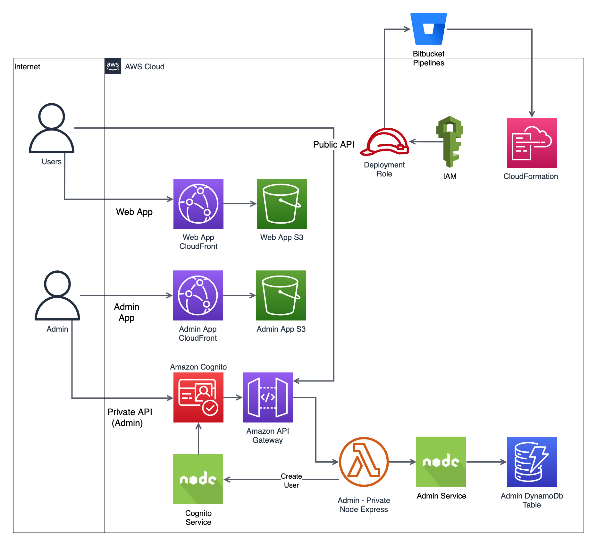

# Baseline Core

Baseline Core is a open source fullstack serverless framework designed to help teams deliver value quickly, frequently, and consistently, while also ensuring safety throughout the entire process. Our framework utilizes a combination of modern technologies, architectures, software delivery practices, and operational processes to help teams build and deploy applications with ease.

If you like Baseline give us a ⭐️

## Major Components

- 🚀 API
- 🖥️ React Admin Website
- 🌐 React User Website
- ⚙️ CI/CD
- 🔧 Developer Tooling
- 🔒 Authentication
- 🔄 Multiple Environments
- 💻 Run Locally
- 🏗️ Infrastructure as Code (IaC)
- 📦 Managed Environment Variables
- ✨ Baseline Commands

## Technology

- 🎁 Package Management: Pnpm + Monorepo
- 🔨 Language & Build: TypeScript + ESBuild
- 🖼 Frontend: React + Vite
- ⚙️ Backend: NodeJS + Express
- 🎨 Linting & Formatting: Prettier + Eslint
- 🏗 IaC: AWS + Serverless Framework
- 🚀 Deploy: Local & Bitbucket CI/CD

## AWS Services

- Cognito
- S3
- Lambda
- DynamoDB
- CloudFormation
- Route53
- Systems Manager
- CloudFront
- API Gateway
- CloudWatch
- SNS

## What can you build with Baseline?

- 🌐 SaaS Solutions: Build software-as-a-service solutions tailored to your audience.
- 🖥️ Web Applications: Develop responsive and scalable web applications.
- 🛒 Marketplaces: Launch and manage online marketplaces with ease.
- 📱 Mobile Applications: Create robust mobile apps for iOS and Android platforms.
- 💼🛍️ B2B/B2C Applications: Seamlessly cater to both business and consumer audiences.
- 🗄️ Headless CMS: Manage content efficiently using a headless content management system.

## Benefits

- Serverless First
- Open source
- Full control
- Cost effective implementation
- Hosted in your own AWS account
- Uses popular technology
- Scales on demand
- Staging and production environments
- Runs locally

# Getting Started

## Local Requirements

These must be installed before following the setup instructions.

- Macos/Linux OS/Windows Subsystem for Linux
  - Node.js v20 (v20 or higher) & npm@10.5.0 or higher [(we suggest installing and using nvm)](https://github.com/nvm-sh/nvm#install--update-script) follow instructions in the link to install, you will generally need to create a new terminal session after installing. If you already have nvm update it before proceeding.
    - If nvm is installed you can switch versions with `nvm install 20 && nvm use 20 && nvm alias default 20 && nvm install-latest-npm`
    - If not using nvm you can manually install node and npm, download from <https://nodejs.org/en/download/> alternatively use the operating system package manager or any other appropriate tool to install node
    - Current versions can be checked with `node -v`, `npm -v`
  - pnpm version 9, version can be checked with `pnpm -v`, install with `npm install -g pnpm@9` [or other methods](https://pnpm.io/installation)
  - [AWS CLI v2](https://aws.amazon.com/cli)
  - Homebrew, for Mac users only, follow install instructions [here](https://brew.sh/)
  - [jq](https://stedolan.github.io/jq/download/) for extracting Cloudformation outputs
    - Install on mac `brew install jq`
    - Install on Linux `sudo yum install jq` or `sudo apt-get install jq`, or other appropriate methods
  - Java Runtime Environment (JRE) version 8.x or newer, it is only required for [DynamoDB local](https://docs.aws.amazon.com/amazondynamodb/latest/developerguide/DynamoDBLocal.html)
    - Install on mac `brew install java`
    - Install on linux `sudo yum install java` or `sudo apt-get install openjdk-8-jdk`, or other appropriate methods
    - DynamoDB local will automatically install in the project when the api is started, java needs to installed before this occurs
  - curl which is used in some of the bash scripts, [curl install instructions](https://everything.curl.dev/get)
  - An IDE such as [Visual Studio Code](https://code.visualstudio.com/)
- Internet connectivity
- AWS Account <https://aws.amazon.com/getting-started/>
- IAM credentials <https://docs.aws.amazon.com/cli/latest/userguide/getting-started-prereqs.html#getting-started-prereqs-iam> be sure to follow [Security best practices in IAM](https://docs.aws.amazon.com/IAM/latest/UserGuide/best-practices.html)

### Experimental Requirements Installation

Alternatively, try the experimental requirements installation script. Use at your own risk.

If you are starting a new Baseline project.

```bash
curl -o- https://raw.githubusercontent.com/Baseline-JS/core/main/scripts/experimental-install-requirements.sh | bash
```

or

```bash
wget -qO- https://raw.githubusercontent.com/Baseline-JS/core/main/scripts/experimental-install-requirements.sh | bash
```

If you are joining an existing Baseline project

```bash
pnpm run install:requirements
```

## Setup

1. Install requirements
2. `npx @baselinejs/create-app my-app-name`
3. `pnpm install`
4. `pnpm run setup` to name your project and set the region
5. `pnpm run aws:profile` to setup your AWS credentials profile (if you have issues please [update aws cli](https://docs.aws.amazon.com/cli/latest/userguide/getting-started-install.html]))
6. `pnpm run deploy:staging` to deploy api/web/admin
7. `pnpm run add:user:staging` to add an admin user to the application
8. `pnpm run urls:staging` To see your project URLs

## Run Locally

If the project is already setup and you are trying run the project locally make sure you run `pnpm run aws:profile` first so that you have the correct credentials for AWS configured locally.

### Commands

Start the api, admin and web in their own terminal windows/tabs with the following commands.

1. `pnpm run generate:env:local` to generate the env files for the frontend clients
2. `pnpm run start:api`
3. `pnpm run start:admin`
4. `pnpm run start:web`

### Running locally Limitations

- API, Web & Admin: No S3, you will need to rely on AWS staging S3
- API: No local Cognito Authorizer, the deployed staging cognito can be used (see `packages/api/serverless.yml`) or the payload set by `AUTHORIZER` in `packages/api/scripts/run-api-local.sh`.
- Admin: Cognito UI relies on an active AWS Cognito user pool, use deployed staging

## Deploy a Change

Swap `staging` to `prod` to deploy to production. All environment variables will be automatically set in the process.

1. `pnpm run deploy:staging` to deploy api/web/admin

## Remove Stack

To destroy the deployed cloudformation stacks so it is no longer on AWS run `pnpm run remove:staging`. This will likely destroy all data associated with the application.

## Setting up Bitbucket

While other code repository platforms can also be used, we recommend using Bitbucket as it is already integrated into our platform and comes with a robust pipeline configuration that is ready to use from the start. If you are using another platform, you will need to configure your own pipeline. You can find the pipeline configuration in the `bitbucket-pipelines.yml` file in the root of the project.

Setup up OpenID Connect between AWS and Bitbucket <https://support.atlassian.com/bitbucket-cloud/docs/deploy-on-aws-using-bitbucket-pipelines-openid-connect/>

Attach an inline policy to the deployment role in IAM from Deployment Role below. This will give the deployment role enough permissions to deploy your application, however you may need to add more permissions depending on your application, for example if you are using S3, DynamoDB, etc. you will need to add permissions for those services. You can find the required permissions in the CloudFormation template for your application. If you are having permission issues or are expecting a wide range of permissions, you can attach the `AdministratorAccess` policy to the deployment role. This is not recommended for production applications. For more information on IAM policies please refer to <https://docs.aws.amazon.com/IAM/latest/UserGuide/access_policies.html>

Enable pipelines and set these repository variables in Bitbucket `AWS_ROLE_ARN` - This can be found in the AWS console under IAM > Roles > Deployment-Role

For more information on Bitbucket Pipeline Environment Variables please refer to <https://support.atlassian.com/bitbucket-cloud/docs/variables-and-secrets/>

### Configuring IAM Role Deployment Role

CloudFormation, Serverless, Serverless plugins and AWS CLI used during the deployment pipeline require enough permissions so that everything can be successfully deployed. Follow the steps below to add and modify the JSON inline policy for the Bitbucket role (Deployment-Role):

- Add the JSON provided below as an inline policy to the "Deployment-Role".
- Replace all instances of `baseline-core` with the name of your application.
- Substitute the AWS account IDs `012345678901` with your personal AWS account ID.
- Review the modified JSON policy to ensure no instances of `baseline-core` or `012345678901` remain.

```json
{
  "Version": "2012-10-17",
  "Statement": [
    {
      "Sid": "cloudformation",
      "Effect": "Allow",
      "Action": "cloudformation:*",
      "Resource": "arn:aws:cloudformation:*:012345678901:stack/baseline-core*/*"
    },
    {
      "Sid": "cognitopass",
      "Effect": "Allow",
      "Action": "iam:PassRole",
      "Resource": "arn:aws:iam::012345678901:role/baseline-core*"
    },
    {
      "Sid": "s3baselinecore",
      "Effect": "Allow",
      "Action": "s3:*",
      "Resource": "arn:aws:s3:::baseline-core*"
    },
    {
      "Sid": "cloudformationgeneral",
      "Effect": "Allow",
      "Action": [
        "cloudformation:ActivateType",
        "cloudformation:BatchDescribeTypeConfigurations",
        "cloudformation:CreateStackSet",
        "cloudformation:CreateUploadBucket",
        "cloudformation:DeactivateType",
        "cloudformation:DeregisterType",
        "cloudformation:DescribeAccountLimits",
        "cloudformation:DescribePublisher",
        "cloudformation:DescribeStackDriftDetectionStatus",
        "cloudformation:DescribeStacks",
        "cloudformation:DescribeType",
        "cloudformation:DescribeTypeRegistration",
        "cloudformation:EstimateTemplateCost",
        "cloudformation:ListExports",
        "cloudformation:ListImports",
        "cloudformation:ListStacks",
        "cloudformation:ListTypeRegistrations",
        "cloudformation:ListTypes",
        "cloudformation:ListTypeVersions",
        "cloudformation:PublishType",
        "cloudformation:RegisterPublisher",
        "cloudformation:RegisterType",
        "cloudformation:SetTypeConfiguration",
        "cloudformation:SetTypeDefaultVersion",
        "cloudformation:TestType",
        "cloudformation:ValidateTemplate"
      ],
      "Resource": "*"
    },
    {
      "Sid": "apigateway",
      "Effect": "Allow",
      "Action": [
        "apigateway:DELETE",
        "apigateway:GET",
        "apigateway:PATCH",
        "apigateway:POST",
        "apigateway:PUT",
        "apigateway:UpdateRestApiPolicy"
      ],
      "Resource": [
        "arn:aws:apigateway:*::/restapis",
        "arn:aws:apigateway:*::/restapis/*",
        "arn:aws:apigateway:*::/tags/*"
      ]
    },
    {
      "Sid": "wideraccess",
      "Effect": "Allow",
      "Action": [
        "cloudfront:CreateCachePolicy",
        "cloudfront:CreateCloudFrontOriginAccessIdentity",
        "cloudfront:CreateDistribution",
        "cloudfront:DeleteDistribution",
        "cloudfront:CreateInvalidation",
        "cloudfront:CreateOriginAccessControl",
        "cloudfront:CreateOriginRequestPolicy",
        "cloudfront:CreatePublicKey",
        "cloudfront:CreateResponseHeadersPolicy",
        "cloudfront:DeleteResponseHeadersPolicy",
        "cloudfront:GetDistribution",
        "cloudfront:GetResponseHeadersPolicy",
        "cloudfront:ListDistributions",
        "cloudfront:ListResponseHeadersPolicies",
        "cloudfront:ListTagsForResource",
        "cloudfront:TagResource",
        "cloudfront:UntagResource",
        "cloudfront:UpdateCachePolicy",
        "cloudfront:UpdateCloudFrontOriginAccessIdentity",
        "cloudfront:UpdateDistribution",
        "cloudfront:UpdateOriginAccessControl",
        "cloudfront:UpdateOriginRequestPolicy",
        "cloudfront:UpdatePublicKey",
        "cloudfront:UpdateResponseHeadersPolicy",
        "cognito-identity:CreateIdentityPool",
        "cognito-identity:DeleteIdentityPool",
        "cognito-identity:SetIdentityPoolRoles",
        "cognito-idp:CreateUserPool",
        "cognito-idp:CreateUserPoolClient",
        "cognito-idp:DeleteUserPool",
        "cognito-idp:DeleteUserPoolClient",
        "cognito-idp:ListTagsForResource",
        "cognito-idp:UpdateUserPool",
        "dynamodb:CreateTable",
        "dynamodb:DeleteTable",
        "dynamodb:DescribeContinuousBackups",
        "dynamodb:DescribeTable",
        "dynamodb:UpdateContinuousBackups",
        "dynamodb:UpdateTable",
        "iam:CreateRole",
        "iam:DeleteRole",
        "iam:DeleteRolePolicy",
        "iam:GetRole",
        "iam:GetRolePolicy",
        "iam:PutRolePolicy",
        "lambda:AddPermission",
        "lambda:RemovePermission",
        "lambda:CreateFunction",
        "lambda:DeleteFunction",
        "lambda:GetFunction",
        "lambda:ListFunctions",
        "lambda:ListTags",
        "lambda:TagResource",
        "lambda:UntagResource",
        "lambda:UpdateFunctionCode",
        "lambda:UpdateFunctionConfiguration",
        "logs:CreateLogGroup",
        "logs:DeleteLogGroup",
        "logs:PutRetentionPolicy",
        "logs:TagLogGroup",
        "s3:ListAllMyBuckets"
      ],
      "Resource": "*"
    }
  ]
}
```

# Project Structure

## Technologies

- Typescript
- AWS
  - CloudFormation
  - CloudFront
  - CloudWatch
  - Route53
  - API Gateway
  - Lambda
  - DynamoDB
  - Systems Manager
  - S3
  - Cognito
- Express
- Serverless Framework
- React
- SCSS
- Vite
- Shell scripts
- Prettier
- ESLint
- ESBuild
- Pnpm

## Concepts

- Monorepo
- Uses only AWS services
- Serverless Architecture
- Infrastructure-as-code
- Scripts to automate
- Deploy from local or pipeline
- Run as much as possible locally
- 3 Stages, local, staging (deployed), prod (deployed)
- Support installable Baseblocks
- Out of the box tools for linting, code formatting, building & debugging
- Typescript everywhere

## Architecture



## Folder Structure

```
.
├── packages
│   ├── admin
│   │   ├── public
│   │   └── src
│   │       ├── baseblocks
│   │       ├── components
│   │       └── styles
│   ├── api
│   │   ├── scripts
│   │   └── src
│   │       ├── baseblocks
│   │       ├── middleware
│   │       └── util
│   └── web
│       ├── public
│       └── src
│           ├── baseblocks
│           ├── components
│           ├── pages
│           └── styles
├── scripts
└── shared
    ├── client-api
    └── types
```

## Major Components

### Packages

Packages contain the parts of the system that are not directly shared in code. Things like an API, Web client or Mobile application. They will often consume shared workspaces from the Shared folder. Each one is a npm workspace and has it's own build processes and deployments.

- Admin: A React static website (SPA) for managing the CMS
- Api: A modular API with public and private (authenticated) access, mostly contains all things Backend
- Web: A React static website (SPA) for users to view and interact with CMS

### Shared

Shared, as the name indicates are shared packages used in one or multiple packages in the monorepo. Each one is a npm workspace.

- Types: Typescript types that are expected to be used in multiple places so there are no duplicate definitions or versions.
- Client Api: Aimed at being a simple SDK for the API to make implementing in multiple clients easy

### Scripts

Project scripts that are used for automation and gluing the platform system can be found in these folders. These scripts enable us to deploy from local or pipeline, run code locally with the same code that gets deployed, reduce duplications of values that become difficult to maintain, help set the project up and generally to improve developer experience.

#### Script Usage

We understand that learning a bunch of scripts and trying to figure out their inputs is not always a time efficient journey and have made accessing the scripts easier by setting up package.json scripts to handle the different inputs. It is also a way to future proof the way that you interact with Baseline to remain the same no matter what is happening under the hood, so if a script changes you will not notice since the package.json script reference will remain the same (if possible).

### Package Management

Using npm workspaces and pnpm to handle node packages.

# Extending

## Adding New Object

A new object can be added to Baseline by running the following command. This will create the necessary files and folders for the new object. This includes the API endpoints, DynamoDB table, function and resource yaml, as well as the client api and types.

```
pnpm run add:object
```

# Prettier

Prettier is used to format all code in the project. It can be run manually with the following command which will run all the prettier scripts in the project.

```
pnpm run pretty
```

# Environment Variables

All environment variables in Baseline should be managed though the npm scripts. There should be no need for copying or sending environment files or values to other developers. All shared environment variables (things that are not from Cloudformation outputs) are stored in AWS Parameter Store. Deployment pipelines will also use these variables rather than the pipelines supplied solution to environment variables.

## Generating from existing project

This will generate the appropriate env files into the frontend clients.

```
pnpm run generate:env:local
pnpm run generate:env:staging
pnpm run generate:env:prod
```

The API will retrieve it's values without an env file.

## Adding a New Environment Variable

### API

After running this any local API Lambda should be able to access the environment variable `process.env.BIRD`. Be sure to create the values for each stage or you will have deployment issues.

```
Demo % pnpm run add:env:local

> add:env:local
> ./scripts/add-env-var.sh local

Profile: [baseline-core]
Region: [ap-southeast-2]
Stage: [local]
Create new environment variable for stage [local]
Used in Frontend or Backend (f/B)? Backend
Enter new variable name (in CAPS): BIRD
Is it secret (y/n)? Yes
Enter new value: ******
Checking AWS SSM for existing record...

An error occurred (ParameterNotFound) when calling the GetParameter operation:
No existing record
Pushing to AWS SSM...
done
Updating packages/api/serverless.yml...
done - don't forget to add the variable to all stages
```

### Front End Client

After running this any client code should be able to access the environment variable `process.env.REACT_APP_TEST`. Be sure to create the values for each stage or you will have deployment issues.

```
Demo % pnpm run add:env:local

> add:env:local
> ./scripts/add-env-var.sh local

Profile: [baseline-core]
Region: [ap-southeast-2]
Stage: [local]
Create new environment variable for stage [local]
Used in Frontend or Backend (f/B)? Frontend
Enter new variable name (in CAPS): TEST
Frontend env vars are never secret, using plaintext.
Enter new value: Test Value
Checking AWS SSM for existing record...

An error occurred (ParameterNotFound) when calling the GetParameter operation:
No existing record
Pushing to AWS SSM...
done
Updating scripts/generate-env-vars.sh...
Updating packages/web/vite.config.ts...
Updating packages/admin/vite.config.ts...
Generating fresh env vars file...
done - don't forget to add the variable to all stages
```

# NPM Workspaces

## Project Specific

It is recommended to follow the naming scheme used by the packages in the project. This will keep references in the code consistent and make it easier to find things. There is a chance naming them could cause issues with any external examples that may expect the package to be named a certain way.

# Baseline

If you would like to learn more about what we do please visit [Baseline](https://baselinejs.com/)
